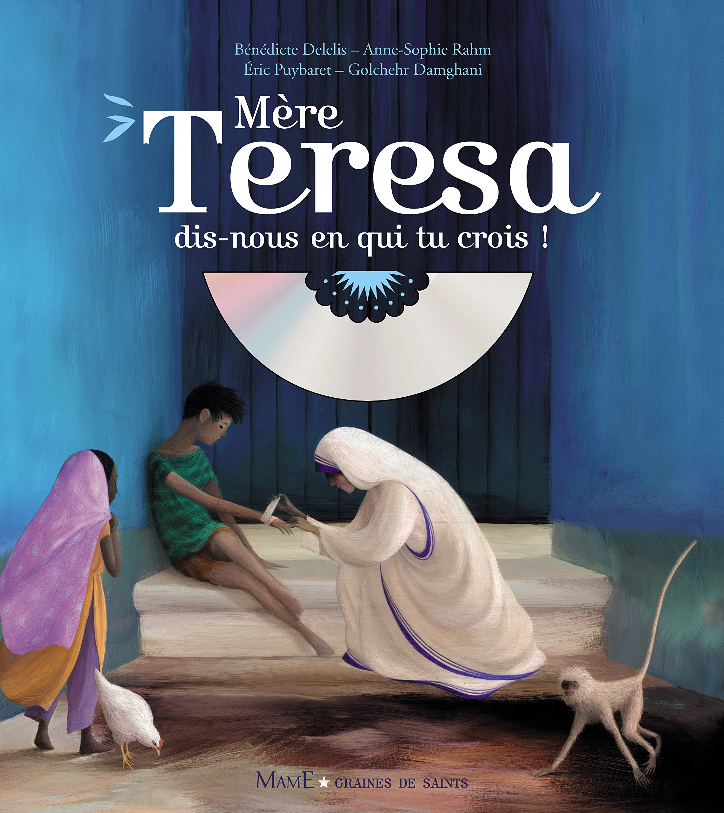

Grâce à cette liste, nous vous proposons de vivre le confinement en Chrétien, c'est-à-dire de chercher tout au long de ce confinement à grandir dans notre foi, notre espérance et notre charité.

Cette liste est nécessairement limitée, nous avons choisi de ne pas être exhaustif mais de vous proposer uniquement des contenus de grande qualité.

Cette liste est collaborative, n'hésitez pas à nous contacter pour ajouter vos idées : [contact@chretiens-en-confinement.org](mailto:contact@chretiens-en-confinement.org)

## 🙏 Prier

### Suivre la messe

* Voir la liste sur KTO : [Où suivre la messe en direct sur Internet ?](https://www.ktotv.com/page/quelles-sont-les-paroisses-qui-diffusent-la-messe-dominicale-en-video)
* Avec le Pape chaque matin à 7h : [c'est ici - avec une rediffusion pour ceux qui dorment encore à 7h](https://www.ktotv.com/page/coronavirus-la-messe-du-pape-chaque-matin-a-7h-en-direct-sur-kto) - YouTube
* La messe de la communauté de l'Emmanuel en direct, à 12h en semaine et 11h le
  dimanche est sur [Emmanuel Play](https://play.emmanuel.info/)

Pour mieux célébrer le dimanche :

* Vous pouvez regarder la vidéo [Vivre la messe en famille pendant le confinement](https://www.youtube.com/watch?v=RpszGrDJ6lI&feature=youtu.be) qui propose des conseils très pratiques.
* Les éditions Mame mettent à disposition pour chaque dimanche un dossier avec des coloriages, une aide guidée pour expliquer l'évangile du jour et des extraits de l'évangile en BD sur [célébrer le dimanche en famille à la maison](https://www.mameeditions.com/vivre-la-messe-en-famille-a-la-maison)
* [prierenfamille](https://www.prierenfamille.com/) aide les parents à accompagner leurs enfants vers Dieu chaque dimanche avec des coloriages, des explications de l'Évangile, etc.

### Participer à un groupe de prière

* [Hozana](https://hozana.org/live) propose un vaste programme de prière pendant le confinement, notamment une [neuvaine](https://hozana.org/communaute/8816-neuvaine-pour-les-victimes-du-coronavirus)
* Suivre la [Retraite dans la Ville](https://www.retraitedanslaville.org/)

### Prier en famille

* Commencer à réciter l'angélus, en union avec les chrétiens du monde entier, à 7h, 12h, et 19h. Chanter par exemple la version sur l'air de Greensleeves : [Voici que l'ange Gabriel](https://www.youtube.com/watch?v=nyYhhLzorb8).
* Le Service National de la Pastorale Liturgique et Sacramentelle propose une [liturgie familiale](https://liturgie.catholique.fr/accueil/annee-liturgique/le-dimanche/302749-liturgie-domestique-5eme-dimanche-de-careme-annee-a/)

### Prier seul

* Magnificat est disponible gratuitement en ligne pendant le confinement : [Prier avec Magnificat](https://francais.magnificat.net/prier)
* L'application [Prie en chemin](https://prieenchemin.org/) propose la méditation guidée d'un passage de la liturgie (podcast de 15 min) + des prières spécifiques pour vivre ce temps d'isolement
* Participez à [la traversée, une aventure spirtuelle pendant le confinement](https://frejustoulon.fr/la-traversee-une-aventure-humaine-et-spirituelle-a-travers-le-covid-19/) proposée par le diocès de Fréjus Toulon.
* [Découvrir Dieu - pour rencontrer Dieu dans nos vies de tous les jours](https://decouvrir-dieu.com/) vous envoie un email tous les jours avec l’évangile, un commentaire pour vous aider à le méditer et un chant pour vous accompagner.

## 📖 Nourrir ma prière

En commençant par lire la Bible, bien sûr :

* Disponible intégralement et gratuitement dans sa traduction officielle sur [AELF](https://www.aelf.org/)
* Des apps permettent également d'y accéder, dont [The Bible App (YouVersion)](https://www.youversion.com/the-bible-app/)
  (installée plus de 415 M de fois, elle propose de nombreuses traductions en
  français, des plans de lectures, etc.)

Propositions plus spécifiques :

* Suivez les conférences de Carême proposée par le diocèse de Paris : [Conférences 2020 - Diocèse de Paris](https://www.paris.catholique.fr/-conferences-2020-.html)

Deux podcasts pour écouter l'Évangile avec ses commentaires :

* L'Evangile du jour : [Évangile et commentaire](https://radionotredame.net/emissions/evangiledujouretcommentaire/) sur Radio Notre Dame
* L'Evangile du dimanche : [Enfin une bonne nouvelle](https://rcf.fr/spiritualite/enfin-une-bonne-nouvelle) sur RCF

## 🎓 Me former

### Lire

L'Église propose tous ses contenus en ligne :

* [Encycliques du Pape François](http://www.vatican.va/content/francesco/fr/encyclicals.index.html)
* [Exhortations Apostoliques du Pape François](http://www.vatican.va/content/francesco/fr/apost_exhortations.index.html)
* [Homélies 2020 du Pape François](http://www.vatican.va/content/francesco/fr/homilies/2020.index.html#homilies)
* [Catéchisme de l'Église Catholique](http://www.vatican.va/archive/FRA0013/_INDEX.HTM)

### Suivre un cours de théologie

* Institut Docteur Angélique, [Cours de théologie catholique](http://docteurangelique.free.fr/cours.html)
* [Premiers pas catholiques](https://premierspascatholiques.wordpress.com/) (Petits cours de théologie sur différentes questions de notre religion)
* [iAquinas](https://www.youtube.com/channel/UCxZHuVgmRJpuwEYMiX0QYtQ/videos) (Petites vidéos à l'école de saint Thomas d'Aquin)
* [SINOD](https://sinod.fr/) recense les MOOC proposés par le Collège des Bernardins.
* Toutes les formations du Collège des Bernardins sont disponibles [en ligne](https://www.collegedesbernardins.fr/archives?page=0&mode=n&keys=1061&s=&f=&y=)
* [ThéoDom](https://www.theodom.org/) est une proposition de cours de théologie par les Dominicains
* Regarder les [jeudis théologie](https://www.ktotv.com/emissions/jeudis-theologie) sur KTOTV

### Répondre à mes questions sur la foi et l'Eglise

* [Pourquoi, Padre ?](https://www.ktotv.com/emissions/pourquoi-padre) sur KTOTV répond à des questions du grand public de façon claire et précise.
* La chaîne [Padreblog](https://www.youtube.com/channel/UCRSBl51vh5qVSn3rDXFiitQ) propose de nombreux contenus d'actualités.
* La communauté de l'Emmanuel propose une webtv « [Emmanuel Play - La WebTV qui diffuse la joie de Dieu](https://play.emmanuel.info/) » et a notamment lancé le [Cathoflix](https://play.emmanuel.info/playlist/cathoflix-15477/)

## 🇬🇧 Me former (en anglais)

### Suivre un cours de théologie

* Découvrez St Thomas d'Aquin avec [Aquinas 101](https://aquinas101.thomisticinstitute.org/) proposé par le Thomistic Institute.
* Profitez d'un des nombreux contenus proposés par [Word on Fire](https://www.wordonfire.org/), un projet de Mgr Barron.

### Écouter un podcasts (en anglais)

* Bishop Barron, [The Word on Fire Show](https://www.wordonfireshow.com/)
* Matt Fradd, [Pints with Aquinas](https://pintswithaquinas.com/)

## ⛑ Donner

### Donner de mon argent

* [La Quête](https://jedonnealeglise.fr/) Donner à la quête en ligne
* [CredoFunding, plateforme de financement participatif chrétien](https://www.credofunding.fr/fr)
* [Plate-forme nationale d’offrande de quête en ligne- CEF](https://donner.catholique.fr/quete/~mon-don?_cv=1)

### Donner de mon temps

#### Aider les autres

* Envoyez des lettres pour donner le sourire aux personnes isolées grâce à [1 lettre 1 sourire](https://1lettre1sourire.org/)

#### Créer et partager du contenu en ligne

* Le diocèse de Nantes propose des [tutos pour retransmettre une messes sur Youtube et Facebook](https://diocese44.fr/retransmission-de-messes-en-loire-atlantique/)
* [Jésus Box - tuto confinement](https://www.jesusbox.fr/confinement)

## 🏖 Me distraire

### Faire un tour au musée

* [PRIXM](https://www.prixm.org/) dévoile les Écritures et les chefs-d'œuvre qu'elles ont inspirés. Le projet est porté par l’École biblique et archéologique française de Jérusalem

### Regarder un film

* Une sélection de films chrétiens pour tous les âges, en streaming et VOD : [Le Film Chrétien](https://www.lefilmchretien.fr)
* Le site Catéchèse et Catéchuménat propose une [liste de films avec des analyses](https://catechese.catholique.fr/outils/propositions-danimation/294787-propositions-danimation-a-partir-de-films/)

### Écouter de la musique

## 🚸 En famille

### Occuper mes enfants pendant 10 min

* Magnificat Junior propose de très jolis [coloriages](https://francais.magnificat.net/accueil/coloriages/)
* Prions en Église propose également des coloriages dans sa section [En famille](https://www.prionseneglise.fr/en-famille).
* Les éditions Mame met à disposition gracieusement un grand nombre de [coloriages et activités à la maison](https://www.mameeditions.com/coloriages-et-activites-a-la-maison)

### Occuper mes enfants pendant 1 heure

* Les albums [Graines de saints](https://open.spotify.com/artist/6pgw29CZnP7uMfrJu8aoiN?si=f8mQ9lmXQKGJ8_p2kETbyg) proposent d'excellentes vies de saints avec de très beaux chants.
  * [Sainte Teresa de Calcuta](https://open.spotify.com/album/1De7taeBDXQL7d3JNAoPjw?si=awCYr_d7QkKjA3VQ77ccGQ)
  * [Saint François d'Assise](https://open.spotify.com/album/5hknzKNtMQTclf19EZi8kC?si=_q2KWtSFQUiVzzGq1DP9ZQ)
  * [Sainte Thérèse de Lisieux](https://open.spotify.com/album/2IdcVZh8OcEUjfN5QQpTsW?si=w35vcxTLSEapw4SdsCUTUw)
* Théobule propose des [jeux et bricolages](https://www.theobule.org/jeux-et-bricolages).
* Le site Catéchèse et Catéchuménat propose une [liste de films avec des analyses](https://catechese.catholique.fr/outils/jeux/)

### Écouter de la musique avec mes enfants

* Jean-François Kieffer, [Les chansons de Loupio](https://open.spotify.com/album/09MppnnTFAydHGZvPzsVoF?si=Tt6oCpoDQf6SW4FYQJvRiA)

### Jouer avec mes enfants (sans préparation)

* [Zou les Boulons](https://www.librairie-emmanuel.fr/zou-les-boulons-jeu-collaboratif-pour-resserrer-les-boulons-de-la-famille-p-145150) (disponible chez plusieurs marchands en ligne, dont la Librairie de l'Emmanuel)

### Jouer avec mes enfants (avec préparation)

### Faire la catéchèse pour des enfants

* [Théobule, les enfants connectés à la parole de Dieu](https://www.theobule.org/) propose un grand nombre de contenus catéchétiques pour les enfants.
* L'application [The Bible App for Kids (YouVersion)](https://www.youversion.com/the-bible-app-for-kids/) est disponible avec une narration en français ainsi que de nombreuses activités pour découvrir la bible.
* En plus des coloriages et des activités, les éditions Mame proposent également des [ressources catéchèse et éveil à la foi à la maison](https://www.mameeditions.com/ressources-catechese-a-la-maison)
* Le diocèse de Paris propose [un jardin de Pâques à fabriquer avec les enfants](https://www.paris.catholique.fr/un-jardin-de-paques-a-fabriquer-49223.html)
* Le catéchisme de l'Emmanuel pour les enfants de 8 à 11 ans propose pour chaque thème : un chant, une œuvre d’art, une vidéo : [Catéchisme Emmanuel](https://catechisme-emmanuel.com/)

### Faire la catéchèse pour des ados

* [Premiers pas catholiques](https://premierspascatholiques.wordpress.com/) (Petits cours de théologie sur différentes questions de notre religion)
* [Jésus Box - le parcours de carême](https://www.jesusbox.fr/le-parcours-de-careme)

## 👋 Être aidé

Le diocèse des Yvelines propose un accueil téléphonique anonyme sur [Family PHONE](https://familyphone.fr/)

## Autres pages de conseils

* Suivez les conseils de spécialistes pluri-centenaires du confinement ! [Rester cloîtré… des spécialistes vous donnent leurs conseils](https://www.dieumattend.fr/rester-cloitre-conseils-de-specialistes/?fbclid=IwAR2xE4fY8mCoErDK_ixts9xCUkDy0vtvD8Nn1932dMSHexESz_S0vXHmw5Q)

# À propos

## Contribuer

Deux solutions pour contribuer :

* Nous envoyer un email sur [contact@chretiens-en-confinement.org](mailto:contact@chretiens-en-confinement.org)
* Contribuer sur notre repo Github [chretiens-en-confinement](https://github.com/chretiens-en-confinement/website)

## Qui sommes-nous ?

Nous sommes un petit groupe de chrétiens confinés un peu partout en France, qui souhaitons vivre ce temps très particulier en continuant de répondre à notre appel : aimer chaque jour un peu plus Dieu et notre prochain. Internet permet de faire 1000 choses en restant chez soi. Aussi, nous nous efforçons de proposer, par cette liste, du contenu afin de continuer à faire grandir notre foi, notre espérance et notre charité, que nous soyons seul, en couple, en famille, ou en communauté.

Les principaux contributeurs : Père Vincent Gaisne, Louis-Marie Gaisne, Etienne Dein, Charles-Axel Dein
