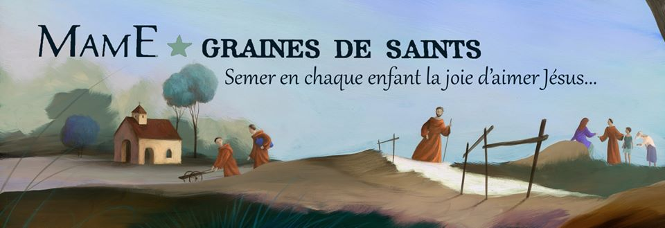

# 🙏 Prier

## Spécial Semaine Sainte et temps pascal

* Un kit pour vivre toutes les célébrations de la Semaine Sainte à la maison, par les dominicains : [Kit Semaine Sainte](https://www.dominicains.com/kit-semaine-sainte-2020/)
* Écoutez les chants de la semaine sainte et du temps de Pâques avec les [Fraternités Monastiques de Jérusalem](https://open.spotify.com/album/7cIxbvypp1OnCp7fOhblw1?si=IFcBwSsjRf2d8wHiGsO19w)
* [Priez pour la régression du Covid-19](https://www.finducovid19.com/) Jeudi, Vendredi et Samedi Saint
* Menez l'enquête et [découvrez ce que le linceul de Turin veut nous révéler](https://www.linceulturin.net/lenquete/)
* 7 évêques se sont associés pour permettre d'[expérimenter la miséricorde de Dieu en 7 jours](https://hozana.org/communaute/8947-parcoursmisericorde)

Pour les enfants :

* Magnificat Junior propose des [coloriages, bandes dessinées et activités](https://francais.magnificat.net/accueil/coloriages/)
* Les [coloriages de Mame](https://www.mameeditions.com/coloriages-et-activites-a-la-maison)
* Théobule propose une sélection d'activité et de jeux pour le [Carême et Pâques](https://www.theobule.org/jeux-et-bricolages)

## Suivre la messe

La liste ci-dessous n'est pas exhaustive et se concentre sur les messes à très grande portée. Nous vous proposons une liste a priori exhaustive ici : [messes catholiques en direct](/messes-catholiques-en-direct)

* Avec le Pape chaque matin à 7h : [c'est ici - avec une rediffusion pour ceux qui dorment encore à 7h](https://www.ktotv.com/page/coronavirus-la-messe-du-pape-chaque-matin-a-7h-en-direct-sur-kto)
* Consultez le programme spécial de KTO : [Le temps du confinement, programmation spéciale sur KTO](https://www.ktotv.com/page/le-temps-du-confinement-programmation-speciale-sur-kto)
* Tous les dimanches sur France 2 à 11h : [Le Jour du Seigneur, les détails ici](https://www.lejourduseigneur.com/)

Pour mieux célébrer le dimanche :

* Vous pouvez regarder la vidéo [Vivre la messe en famille pendant le confinement](https://www.youtube.com/watch?v=RpszGrDJ6lI&feature=youtu.be) qui propose des conseils très pratiques
* La bibliste Marie-Noëlle Thabut commente les évangiles de chaque dimanche sur KTO : [En marche vers dimanche](https://www.ktotv.com/emissions/en-marche-vers-dimanche)

## Suivre la messe avec de jeunes enfants

* Les éditions Mame mettent à disposition pour chaque dimanche un dossier avec des coloriages, une aide guidée pour expliquer l'évangile du jour et des extraits de l'évangile en BD sur [célébrer le dimanche en famille à la maison](https://www.mameeditions.com/vivre-la-messe-en-famille-a-la-maison)
* [PrierEnFamille](https://www.prierenfamille.com/) aide les parents à accompagner leurs enfants vers Dieu chaque dimanche avec des coloriages, des explications de l'Évangile, etc.
* Plein de bonnes idées pour préparer la messe : [une vidéo très bien faite avec des playmobil par la Fraternité Missionaire Marie Mère des Apôtres](https://www.youtube.com/watch?v=YupNjx4Widk)

## Suivre les offices monastiques

* L'abbaye du Barroux propose l'écoute des offices du jour en [direct](https://www.barroux.org/fr/liturgie/ecoutez-nos-offices.html), en différé par [podcast](https://podcasts.apple.com/fr/podcast/les-offices-de-labbaye-du-barroux/id1160516335) ou sur son application mobile : [Android](https://play.google.com/store/apps/details?id=com.leta027.localhost.abbayedubarroux), [iOS](https://apps.apple.com/fr/app/barroux/id486795862)
* Radio Espérance, parmi d'autres contenus, propose la diffusion des offices de diverses abbayes bénédictines sur sa [chaine grégorienne](http://player.radio-esperance.fr/?radio=chant-gregorien#current)

## Prier pour un proche en train de mourir

* Le sanctuaire Notre-Dame de Montligeon propose de vous accompagner à vivre ce temps, malgré la distance : [Un proche est en train de mourir et je ne suis pas là…](https://montligeon.org/un-proche-est-en-train-de-mourir-et-je-ne-suis-pas-la/)

## Participer à un groupe de prière

* [Hozana](https://hozana.org/live) propose un vaste programme de prière pendant le confinement, notamment une [neuvaine](https://hozana.org/communaute/8816-neuvaine-pour-les-victimes-du-coronavirus)
* Suivre la [Retraite dans la Ville](https://www.retraitedanslaville.org/)

## Prier en famille

* Commencer à réciter l'angélus, en union avec les chrétiens du monde entier, à 7h, 12h, et 19h. Chanter par exemple la version sur l'air de Greensleeves : [Voici que l'ange Gabriel](https://www.youtube.com/watch?v=nyYhhLzorb8) (ou cette [autre version sur Spotify](https://open.spotify.com/track/2tXrBWRO8CnUJodCupH2Tp?si=ktlWI63kR2iPEbGjIDVChg)).
* Le Service National de la Pastorale Liturgique et Sacramentelle propose une [liturgie familiale](https://liturgie.catholique.fr/accueil/annee-liturgique/le-dimanche/302749-liturgie-domestique-5eme-dimanche-de-careme-annee-a/)

## Prier seul

* Magnificat est disponible gratuitement en ligne pendant le confinement : [Prier avec Magnificat](https://francais.magnificat.net/prier)
* L'application [Prie en chemin](https://prieenchemin.org/) propose la méditation guidée d'un passage de la liturgie (podcast de 15 min) + des prières spécifiques pour vivre ce temps d'isolement
* Participez à [la traversée, une aventure spirtuelle pendant le confinement](https://frejustoulon.fr/la-traversee-une-aventure-humaine-et-spirituelle-a-travers-le-covid-19/) proposée par le diocès de Fréjus Toulon.
* [Découvrir Dieu - pour rencontrer Dieu dans nos vies de tous les jours](https://decouvrir-dieu.com/) vous envoie un email tous les jours avec l’évangile, un commentaire pour vous aider à le méditer et un chant pour vous accompagner
* Utiliser l'application iOS [Liturgie](https://apps.apple.com/app/liturgie-la-liturgie-des-heures/id991620025) pour prier la liturgie des heures.

## 📖 Nourrir ma prière

En commençant par lire la Bible, bien sûr :

* Disponible intégralement et gratuitement dans sa traduction officielle sur [AELF](https://www.aelf.org/)
* Des apps permettent également d'y accéder, dont [The Bible App (YouVersion)](https://www.youversion.com/the-bible-app/)
  (installée plus de 415 M de fois, elle propose de nombreuses traductions en
  français, des plans de lectures, etc.)
* [Open Bible](https://hozana.org/communaute/8664-open-bible-lire-comprendre-et-vivre-la-parole-de-dieu) vous propose de prendre 10 min par jour pour (re)découvrir l'évangile de Jésus-Christ selon saint Matthieu.

Propositions plus spécifiques :

* Suivez les conférences de Carême proposée par le diocèse de Paris : [Conférences 2020 - Diocèse de Paris](https://www.paris.catholique.fr/-conferences-2020-.html)
* Participer à la retraite de [Carême dans la ville](https://careme.retraitedanslaville.org/) proposée par les Dominicains. Méditez sur les sept dons du Saint Esprit grâce à une [série de vidéos](https://careme.retraitedanslaville.org/meditations?video=true) avec des très beaux et profonds témoignages.

Deux podcasts pour écouter l'Évangile avec ses commentaires :

* L'Evangile du jour : [Évangile et commentaire](https://radionotredame.net/emissions/evangiledujouretcommentaire/) sur Radio Notre Dame
* L'Evangile du dimanche : [Enfin une bonne nouvelle](https://rcf.fr/spiritualite/enfin-une-bonne-nouvelle) sur RCF

# 🎓 Me former

## Parcourir les fondamentaux de l'Eglise

L'Église propose tous ses contenus en ligne :

* [Encycliques du Pape François](http://www.vatican.va/content/francesco/fr/encyclicals.index.html)
  * Vous pouvez commencer par [Laudato si'](http://www.vatican.va/content/francesco/fr/encyclicals/documents/papa-francesco_20150524_enciclica-laudato-si.html)
* [Exhortations Apostoliques du Pape François](http://www.vatican.va/content/francesco/fr/apost_exhortations.index.html)
* [Homélies 2020 du Pape François](http://www.vatican.va/content/francesco/fr/homilies/2020.index.html#homilies)
* [Catéchisme de l'Église Catholique](http://www.vatican.va/archive/FRA0013/_INDEX.HTM)

## Suivre un cours de théologie

* [Premiers pas catholiques](https://premierspascatholiques.wordpress.com/) (Petits cours de théologie sur différentes questions de notre religion)
* [iAquinas](https://www.youtube.com/channel/UCxZHuVgmRJpuwEYMiX0QYtQ/videos) (Petites vidéos à l'école de saint Thomas d'Aquin)
* [SINOD](https://sinod.fr/) recense les MOOC proposés par le Collège des Bernardins.
* Toutes les formations du Collège des Bernardins sont disponibles [en ligne](https://www.collegedesbernardins.fr/archives?page=0&mode=n&keys=1061&s=&f=&y=). Vous pouvez par exemple commencer par [Les Évangiles de la Passion](https://soundcloud.com/college-des-bernardins/sets/les-evangiles-de-la-passion) et [Les Évangiles de la Résurrection](https://soundcloud.com/college-des-bernardins/sets/les-evangiles-de-la)  par le Père Jean-Philippe Fabre.
* [ThéoDom](https://www.theodom.org/) est une proposition de cours de théologie par les Dominicains
* Regarder les [jeudis théologie](https://www.ktotv.com/emissions/jeudis-theologie) sur KTOTV

## Avoir un éclairage et répondre à mes questions

### Foi et l'Eglise

* [Pourquoi, Padre ?](https://www.ktotv.com/emissions/pourquoi-padre) sur KTOTV répond à des questions du grand public de façon claire et précise.
* La chaîne [Padreblog](https://www.youtube.com/channel/UCRSBl51vh5qVSn3rDXFiitQ) propose de nombreux contenus d'actualités.
* La communauté de l'Emmanuel propose une webtv « [Emmanuel Play - La WebTV qui diffuse la joie de Dieu](https://play.emmanuel.info/) » et a notamment lancé le [Cathoflix](https://play.emmanuel.info/playlist/cathoflix-15477/)
* Consultez les différentes proposition de RCF dans la rubrique [Fondamentaux de la foi, Actualités religieuses](https://rcf.fr/spiritualite/fondamentaux-de-la-foi)
* Chaque jour, l'appli [Pearl](https://pearl.laperledujour.fr/) t’envoie la « perle du jour », une bonne nouvelle catho, insolite et décalée
* Les hors-séries de Famille Chrétienne sont disponibles gratuitement depuis l'application [iOS](https://apps.apple.com/fr/app/famille-chr%C3%A9tienne/id1313833765) ou [Android](https://play.google.com/store/apps/details?id=fr.famillechretienne.dev&hl=fr)

### Psychologie, philosophie et éthique

* [Le blog du père Pascal Ide](http://pascalide.fr/) apporte de nombreux éclairages sur des situations que nous pouvons vivre
* Les podcats/vidéos de [Philia - les Soirées de la Philo](https://www.philia-asso.fr/) sont en libre accès pendant le confinement, pour explorer les grandes questions que nous n’avons pas toujours le temps de nous poser

## 🇬🇧 Me former (en anglais)

### Suivre un cours de théologie

* Découvrez St Thomas d'Aquin avec [Aquinas 101](https://aquinas101.thomisticinstitute.org/) proposé par le Thomistic Institute.
* Profitez d'un des nombreux contenus proposés par [Word on Fire](https://www.wordonfire.org/), un projet de Mgr Barron.

### Écouter un podcasts (en anglais)

* Bishop Barron, [The Word on Fire Show](https://www.wordonfireshow.com/)
* Matt Fradd, [Pints with Aquinas](https://pintswithaquinas.com/)

# ⛑ Donner

## Donner de mon argent

* [La Quête](https://jedonnealeglise.fr/) Donner à la quête en ligne
* [CredoFunding, plateforme de financement participatif chrétien](https://www.credofunding.fr/fr)
* [Plate-forme nationale d’offrande de quête en ligne- CEF](https://donner.catholique.fr/quete/~mon-don?_cv=1)

## Donner de mon temps

### Aider les autres

* Envoyez des lettres pour donner le sourire aux personnes isolées grâce à [1 lettre 1 sourire](https://1lettre1sourire.org/)
* Le diocèse de Nantes [recherche des médecins et des infirmiers/infirmières](https://diocese44.fr/urgent-recherche-dinfirmiers-benevoles-disponibles/) bénévoles pour un centre d’accueil de migrants et personnes de la rue atteints du coronavirus, sans besoin d’hospitalisation
* [« Toujours prêts »: les scouts se mobilisent pour aider les hôpitaux](https://www.lefigaro.fr/actualite-france/toujours-prets-les-scouts-se-mobilisent-pour-aider-les-hopitaux-20200329) (un article du Figaro)

### Créer et partager du contenu en ligne

* Le diocèse de Nantes propose des [tutos pour retransmettre une messes sur Youtube et Facebook](https://diocese44.fr/retransmission-de-messes-en-loire-atlantique/)
* [Jésus Box - tuto confinement](https://www.jesusbox.fr/confinement)
* Découvez le [MOOC de l'académie Sainte Faustine](https://www.academiesaintefaustine.com/cours-en-ligne/) pour apprendre à évangéliser sur Internet (7 cours de 15 minutes en vidéo avec un quiz à chaque fois)

# 🏖 Me distraire

## Respirer... en beauté !

> « La beauté sauvera le monde » F. Dostoïevski

> « Le monde a besoin de beauté pour ne pas sombrer dans la désespérance » Paul VI

Pendant ce temps de confinement, quoi de mieux qu’un bel extrait de concert, d’opéra, pour laisser notre esprit respirer… en beauté ! Une sélection de propositions, rendues gratuites pendant ce confinement :

* Renouer avec le chant grégorien, ici dans la tradition [dominicaine](https://www.youtube.com/channel/UCR4myAMEoTjCu2WVBcuXKSg)
* De Jean-Sébastien Bach, la [Passion selon saint Jean](https://www.youtube.com/watch?v=sidU7AUqQUk) et la [Passion selon saint Matthieu](https://www.youtube.com/watch?v=3v-u2Nkg7mk	)
* De Marc-Antoine Charpentier, les [Leçons de Ténèbres](https://www.youtube.com/playlist?list=OLAK5uy_knRr_CdXwU2ENdigiluqV5mSey5rHfVZw)
* Les [Lamentations de Jérémie](https://youtu.be/MF3IUM2V-ss) de Zelenka
* Le Boléro de Ravel en [télétravail](https://www.youtube.com/watch?v=Sj4pE_bgRQI) !
* Voyager avec les plus [grands ballets du Bolchoï](https://www.youtube.com/user/bolshoi) de Moscou !
* Laisser la musique s’inviter chez nous, avec la [Philarmonie de Paris](https://philharmoniedeparis.fr/fr/la-philharmonie-s-invite-chez-vous)
* Rejoindre le [violoniste Renaud Capuçon](https://www.facebook.com/RenaudCapucon/) chez lui, pour un inédit quotidien

## Faire un tour au musée

* [PRIXM](https://www.prixm.org/) dévoile les Écritures et les chefs-d'œuvre qu'elles ont inspirés. Le projet est porté par l’École biblique et archéologique française de Jérusalem

## Regarder un film

* Une sélection de films chrétiens pour tous les âges, en streaming et VOD : [Le Film Chrétien](https://www.lefilmchretien.fr)
* Le site Catéchèse et Catéchuménat propose une [liste de films avec des analyses](https://catechese.catholique.fr/outils/propositions-danimation/294787-propositions-danimation-a-partir-de-films/)
* Aleteia propose une sélection de film à regarder pendant le confinement : [Douze films à (re)voir pendant la période de confinement](https://fr.aleteia.org/2020/03/30/les-douze-films-a-revoir-pendant-la-periode-de-confinement/)
* Regardez le Seigneur des anneaux avec un regard chrétien, par exemple en visionnant l'analyse de frère Philippe Verdin, OP : [la Résurrection selon Tolkien](https://www.theodom.org/tolkien/)

## S'alimenter différemment

* [Divine Box](https://divinebox.fr/) vous fait découvrir les meilleurs produits des abbayes, livrés chez vous

# 🚸 En famille

## Occuper mes enfants pendant 10 min

* Magnificat Junior propose de très jolis [coloriages](https://francais.magnificat.net/accueil/coloriages/)
* Les éditions Mame met à disposition gracieusement un grand nombre de [coloriages et activités à la maison](https://www.mameeditions.com/coloriages-et-activites-a-la-maison)

## Occuper mes enfants pendant 1 heure

* Les albums [Graines de saints](https://open.spotify.com/artist/6pgw29CZnP7uMfrJu8aoiN?si=f8mQ9lmXQKGJ8_p2kETbyg) proposent d'excellentes vies de saints avec de très beaux chants.
  * [Sainte Teresa de Calcuta](https://open.spotify.com/album/1De7taeBDXQL7d3JNAoPjw?si=awCYr_d7QkKjA3VQ77ccGQ)
  * [Saint François d'Assise](https://open.spotify.com/album/5hknzKNtMQTclf19EZi8kC?si=_q2KWtSFQUiVzzGq1DP9ZQ)
  * [Sainte Thérèse de Lisieux](https://open.spotify.com/album/2IdcVZh8OcEUjfN5QQpTsW?si=w35vcxTLSEapw4SdsCUTUw)
* Théobule propose des [jeux et bricolages](https://www.theobule.org/jeux-et-bricolages).
* Le site Catéchèse et Catéchuménat propose une [liste de films avec des analyses](https://catechese.catholique.fr/outils/jeux/)

## Écouter de la musique avec mes enfants

* Jean-François Kieffer, [Les chansons de Loupio](https://open.spotify.com/album/09MppnnTFAydHGZvPzsVoF?si=Tt6oCpoDQf6SW4FYQJvRiA)
* [Soeur Agathe](https://open.spotify.com/artist/6yLJHGxVuHych1O7WsPRhJ?si=Yki27oVzQ5eeMsp7kULJBw)

## Jouer avec mes enfants (sans préparation)

* [Zou les Boulons](https://www.librairie-emmanuel.fr/zou-les-boulons-jeu-collaboratif-pour-resserrer-les-boulons-de-la-famille-p-145150) (disponible chez plusieurs marchands en ligne, dont la Librairie de l'Emmanuel)

## Occuper mes ados

* Aleteia propose de bonnes idées dans cet article : [Vous êtes scout et confiné ? Dix activités à faire pour ne pas perdre la main (et la tête)](https://fr.aleteia.org/2020/03/27/vous-etes-scout-et-confine-dix-activites-a-faire-pour-ne-pas-perdre-la-main-et-la-tete/)
* [Les règles à se fixer quand le temps d’écran de la famille explose](https://fr.aleteia.org/2020/04/01/les-regles-a-se-fixer-quand-le-temps-decran-de-la-famille-explose/) (toujours chez Aleteia)

## Faire la catéchèse pour les enfants

* [Théobule, les enfants connectés à la parole de Dieu](https://www.theobule.org/) propose un grand nombre de contenus catéchétiques pour les enfants.
* L'application [The Bible App for Kids (YouVersion)](https://www.youversion.com/the-bible-app-for-kids/) est disponible avec une narration en français ainsi que de nombreuses activités pour découvrir la bible.
* En plus des coloriages et des activités, les éditions Mame proposent également des [ressources catéchèse et éveil à la foi à la maison](https://www.mameeditions.com/ressources-catechese-a-la-maison)
* Le diocèse de Paris propose [un jardin de Pâques à fabriquer avec les enfants](https://www.paris.catholique.fr/un-jardin-de-paques-a-fabriquer-49223.html)
* Le catéchisme de l'Emmanuel pour les enfants de 8 à 11 ans propose pour chaque thème : un chant, une œuvre d’art, une vidéo : [Catéchisme Emmanuel](https://catechisme-emmanuel.com/)
* Le site Catéchèse et Catéchuménat propose de nombreux [jeux](https://catechese.catholique.fr/outils/jeux/).

## Faire la catéchèse pour les ados

* [Premiers pas catholiques](https://premierspascatholiques.wordpress.com/) (Petits cours de théologie sur différentes questions de notre religion)
* [Jésus Box - le parcours de carême](https://www.jesusbox.fr/le-parcours-de-careme)
* Découvez les vidéos du [Parcours Alpha Jeunes](https://www.youtube.com/watch?v=_dLQ3wvF5wE&list=PLiVJ7ObStzQ3EbGJDgqMV7Sp-PEt1tw6E) (il existe une version sous-titrée et une version doublée en français).
* Le site [Rencontrer Jésus](https://jesus.catholique.fr/) de l'église catholique en France propose des questions, des témoignages, des oeuvres d'art, etc.

## Faire grandir mon couple

* Se former et s'exercer à la communication non violente (CNV). De nombreux contenus et articles sont disponibles sur Internet.
* Jouer à la [La Boîte de Comm' du Couple](https://www.lesboitesdecomm.com/la-boite-de-comm-du-couple)
* S'exercer tous les jours pour utiliser les trois mots qui ouvrent à une vie de famille réussie : [puis-je, merci, pardon](https://www.famillechretienne.fr/eglise/pape-et-vatican/pape-francois-trois-mots-pour-une-vie-familiale-heureuse-167312)

# 👋 Être aidé

* Le diocèse des Yvelines propose un accueil téléphonique anonyme sur [Family PHONE](https://familyphone.fr/)
* L'Église de France a mis en place un [une cellule d'écoute](https://www.vaticannews.va/fr/eglise/news/2020-04/france-eglise-coronavirus-ecoute.html?fbclid=IwAR0c6ENFqSFXf1YSY6iPqioGz7U62kMA8eumTx-2xbtp1o7Z5wk-DAxXtHQ) : <a href="tel:0806700772">0806 700 772</a>.

# Autres pages de conseils

* Suivez les conseils de spécialistes pluri-centenaires du confinement ! [Rester cloîtré… des spécialistes vous donnent leurs conseils](https://www.dieumattend.fr/rester-cloitre-conseils-de-specialistes/?fbclid=IwAR2xE4fY8mCoErDK_ixts9xCUkDy0vtvD8Nn1932dMSHexESz_S0vXHmw5Q)
* Aleteia propose un [Kit de survie spirituelle pour son Carême à la maison](https://fr.aleteia.org/coronavirus-vivre-careme-dimanche-semaine-sainte-priere-paques-maison/)
* [Confinement : 25 activités que les chrétiens peuvent faire chez eux !](https://chretienslifestyle.com/confinement-activites-pour-chretiens/) (Chrétiens lifestyle)

# À propos

## Qui sommes-nous ?

Nous sommes un petit groupe de chrétiens confinés un peu partout en France, qui souhaitons vivre ce temps très particulier en continuant de répondre à notre appel : aimer chaque jour un peu plus Dieu et notre prochain. Internet permet de faire 1000 choses en restant chez soi. Aussi, nous nous efforçons de proposer, par cette liste, du contenu afin de continuer à faire grandir notre foi, notre espérance et notre charité, que nous soyons seul, en couple, en famille, ou en communauté.

Les principaux contributeurs : Père Vincent Gaisne, Père Jean-Baptiste Siboulet, Louis-Marie Gaisne, Etienne Dein, Charles-Axel Dein

## Contribuer
